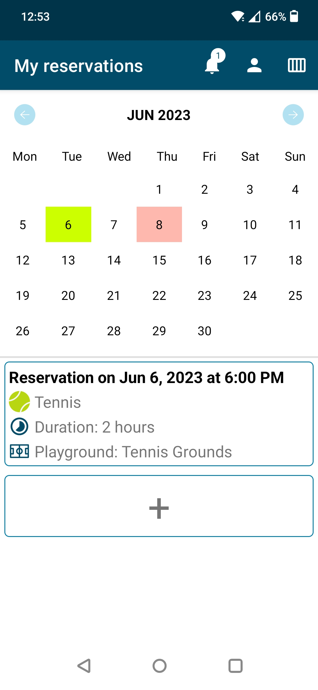

# Mobile Application Development Labs
### Repository for the laboratories of the Mobile Application Development course

The repository contains the 5 laboratories and the final project for the Mobile Application Development course (A.Y. 2022/23, Politecnico di Torino). Each folder contains the PDF of the assignment.

## Lab 1: Kotlin Exercism exercises

4 exercises from the Exercism Kotlin track: Bank account, Forth, List-Ops and Minesweeper

## Labs 2-5 and final project: Playgrounds Reservations

The following labs and the final project were aimed at creating an app for making reservations for available playgrounds to play a selection of sports.

The app is what can be considered a proof of concept: its main goal was to test and showcase all the different technologies that can be used to develop an Android application. For this very reason the app is a mix of activities and fragments, view-based screens and Jetpack Compose ones.

Optimizations were also not performed, mostly due to time constraints: most notably, the whole app operates from the main thread and frequently skips frames.

### Features

- Explore the playgrounds availability, also without logging in
- Login and sign up with email/password or with a Google account
- Visualize already placed reservation through a calendar
- Make a new reservation, selecting a playground from recents or favourites ones or searching for one through filters
- Edit or delete an existing reservation
- Invite friends to a reservation, selecting from recents or favourites users or searching for one
- Receive in-app notifications for incoming invitations to reservation
- Withdraw participation from an accepted invitation to a reservation
- Personalize your profile with personal information to be displayed to friends and users of the app

### Horizontal features
- The app supports multi-language localization and is fully translated in English and Italian
- The app supports both portrait and landscape orientations and the layout is sufficiently diversified fot the two alternatives

### Technologies used
- The app is fully developed in Kotlin
- View-based activities and fragment
- Jetpack Compose fragments (to integrate with the navigation graph used for fragments)
- Firestore Firebase database
- Firebase UI authentication
- Firebase storage for saving profile images
- Local Room database for labs 3 and 4

### Known bugs and limitations
- The app supports a dark mode too, but the color scheme was not dutifully tested
- Accepting an invitation while the inviter disinvites you
- Two users making a reservation at the same time
- In general, concurrency has not been handled

We apologize if any of the techologies, plugins or components used required an aknowledgement and it was not provided: please note that the app was never meant to be public or operative.

### Screenshots

|  Calendar |  Playgrounds availability |  Add reservation |
| :-------------: | :-------------: | :-------------: |
|  **Choose playground** |  **Show reservation** |  **Notifications screen** |
|  **Show profile** | | |

### Folders content and brief changelog

- Lab 2
	- Show and edit personal profile

- Lab 3 
	- Show personal reservations
	- Explore playgrounds availability
	- Add, edit and delete a reservation
	- Introduced local Room database

- Lab 4
	- Rate a previously reserved court

- Lab 5
	- See past ratings for a specific playground
	- Login (multi-user interactions properly managed)
	- Loading screens
	- Moved to Firebase database

- Final project
	- Invite friends to reservations
	- Manage received invites from notifications
	- Add friends and playgrounds to favourites
	- General bug fixing and management of corner cases

[🌐 Qui in italiano](README_it.md)