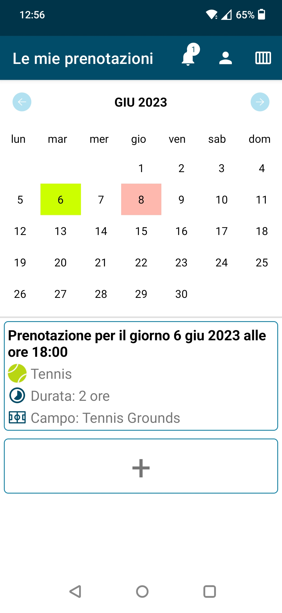

# Mobile Application Development Labs
### Repository per i laboratori del corsi di Mobile Applucation Development

Il repository contiene i 5 laboratori e il progetto finale per il corso di Mobile Application Development (A. A. 2022/23, Politecnico di Torino). Ogni cartella contiene il PDF della consegna.

### Screenshot

|  Calendario |  Disponibilità dei campi |  Aggiungi prenotazione |
| :-------------: | :-------------: | :-------------: |
|  **Scegli campo** |  **Mostra prenotazione** |  **Schermata delle notifiche** |
|  **Mostra profilo** | | |

[🌐 Here in English](README.md)